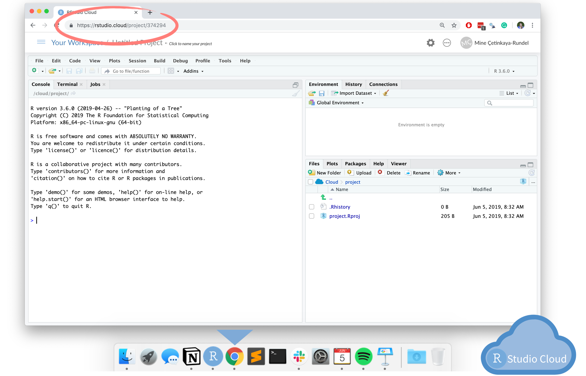

```{r setup, include=FALSE}
options(digits = 3)
knitr::opts_chunk$set(
  comment = "#>",
  echo = TRUE,
  collapse = TRUE,
  message = FALSE,
  warning = FALSE,
  out.width = "50%",
  fig.align = "center",
  fig.asp = 0.618, # 1 / phi
  fig.show = "hold"
)
```

<!-- 数据科学介于  理论和应用之间，起到一个桥梁作用。 -->

<!-- 掌握这个技能，可以 -->

<!-- - 用在工业生产上：公司企业需要，（学科背景+ 统计编程）= 找工作、提升竞争力  找工作 -->
<!-- - 用在创新创业上：培养编程思维，参加各种竞赛，数学建模，算法设计、参与工程项目   赚钱不要想着兼职就是发传单和做家教，也可以是做项目、创新创业。这样既有安全、又有收益 -->
<!-- - 用在科学研究上：读研读博，自然科学、社会科学都需要   发文章 -->
<!-- - 用在学习方法上：改变传统的统计学习方法,  贝叶斯新统计    -->


## 开场白

\LARGE
- 非常感谢百智享公司唐总的热情邀请，以及林晗川工程师的细致安排


## 本节课的目的


- R能给我们生活带来什么？
  - R是什么?
  - R能干什么?
  - 为什么是R？
  
\vskip 0.5cm

- 五分钟上手R语言
  - 需要一台电脑
  - 注册一个 https://rstudio.cloud 账号
  - 登录 https://rstudio.cloud/project/1847233


# R是什么

## R那些事

- 1992年，新西兰奥克兰大学统计学教授 Ross Ihaka 和 Robert Gentleman，为了方便地给学生教授统计学课程，他们设计开发了R语言（他们名字的首字母都是R）。

```{r echo=FALSE, out.width = '0.8\\textwidth'}
knitr::include_graphics(path = "images/R_inventor.png")
```


## R是什么

R语言是用于统计分析，图形表示和报告的编程语言:

- R 是一个\textcolor{red}{统计编程}语言（statistical programming）
- R 可运行于多种平台之上，包括Windows、UNIX 和 Mac OS X
- R 拥有顶尖水准的\textcolor{red}{制图}功能
- R 是免费的
- R 应用广泛，拥有丰富的\textcolor{red}{库包}
- 活跃的\textcolor{red}{社区}(\#rstats)


## R 的前世今生

- 2000年，R1.0.0 发布
- 2004年，第一届国际useR!会议（随后每年举办一次）
- 2005年，ggplot2宏包（2018.8 - 2019.8下载量超过 1.3 亿次）
- 2012年，R2.15.2 发布
- 2013年，R3.0.2 发布, CRAN上的宏包数量5026个
- 2016年，Rstudio公司推出 tidyverse 宏包（数据科学当前最流行的R宏包）
- 2017年，R3.4.1 发布，CRAN上的宏包数量10875个
- 2019年，R3.6.1 发布，CRAN上的宏包数量15102个
- 2020年，R4.0.0 发布，CRAN上的宏包数量16054个

[The History of R](https://blog.revolutionanalytics.com/2020/07/the-history-of-r-updated-for-2020.html)


## R语言发展趋势

```{r echo=FALSE, out.width = '100%'}
knitr::include_graphics("images/tiobe-index.png")
```

[TIOBE index](https://www.tiobe.com/tiobe-index/)


## 安装很方便

官网地址：<https://www.r-project.org/>

```{r echo=FALSE, out.width = '100%'}
knitr::include_graphics("images/Rinstall.png")
```

## IDE很舒服

官网地址：<https://rstudio.com/>

```{r out.width = '80%', echo = FALSE}
knitr::include_graphics("images/rstudio-editor.png")
```

## 两者的关系

```{r out.width = '100%', echo = FALSE}
knitr::include_graphics("images/engine_dashboard.png")
```


## 也可以偷懒

```{r echo=FALSE, out.width = '100%'}

```

注册就可使用：<https://rstudio.cloud/>


## 平台很友好

```{r out.width = '99%', echo = FALSE}

```


## R路上的大神

2019 年 8 月，国际统计学年会将考普斯总统奖（\textcolor{red}{被誉为统计学的诺贝尔奖}）奖颁给 tidyverse 的作者

```{r echo=FALSE, out.width = '50%'}
knitr::include_graphics("images/hadley-wickham.jpg")
```

- [Hadley Wickham](http://hadley.nz/)
- R路上的大神
- 一个改变了R语言的人

# R能干什么

## 数据科学的流程

Hadley Wickham将[数据科学流程](https://r4ds.had.co.nz/)分解成6个环节


```{r echo=FALSE, out.width = '\\textwidth'}
knitr::include_graphics(path = "images/data-science-explore.png")
```


## tidyverse套餐

```{r out.width = '80%', echo = FALSE}
knitr::include_graphics("images/tidyverse.png")
```
\centering{https://www.tidyverse.org/}


## 以最快的速度获得一次成功的经验

- 登录 https://rstudio.cloud
- 打开链接 https://rstudio.cloud/project/1847233
- 运行代码（点击右上角的 `Run`）

```{r out.width = '100%', echo = FALSE}
knitr::include_graphics("images/rstudio-cloud-run.png")
```


## 生成pdf

```{r out.width = '65%', echo = FALSE}

```

- Console中输入`tinytex::install_tinytex()`回车
- 等待2分钟，然后重新点击`Knit`就可以看到pdf了


## R能干什么 

| 序号 	| 内容         	| 代码演示                                        	|
|------	|--------------	|-------------------------------------------------	|
| 1    	| 统计         	| [1_stats.R](./exercises/01_stats.R)              	|
| 2    	| 可视化       	| [2_visual.R](./exercises/02_visual.R)       	      |
| 3    	| 探索性分析   	| [3_eda.R](./exercises/03_eda.R)         	          |
| 4    	| 可重复性报告 	| [4_reproducible.R](./exercises/04_reproducible.R) 	|


## 难吗？
\Huge
\centering{ 感觉很难吗？ \\ 如果是，那说明你认真听了}


## 看了这些代码，可能第一眼感觉是这样的
```{r echo=FALSE, out.width = '100%', fig.cap='图片来自电影《降临》'}
knitr::include_graphics("images/arrival-movie.png")
```


## 但我更希望学完后
```{r echo=FALSE, out.width = '100%', fig.cap='图片来自美剧《权利的游戏》'}
knitr::include_graphics("images/night_king.jpg")
```


# 为什么是R


## 社会科学需要统计

```{r echo=FALSE, out.width = '60%'}
knitr::include_graphics("images/social_science.jpg")
```

\centering{我们不是学统计的，但需要统计}


## 社会科学需要可视化

```{r echo=FALSE, out.width = '100%'}
knitr::include_graphics("images/HotlineDrake1.jpg")
```


\centering{我们不是学美术的，但要可视化}


## 社会科学需要编程

```{r out.width = '100%', fig.align='center', echo = FALSE}
knitr::include_graphics("images/R_Excel.png", dpi = 150)
```

\centering{我们不是学计算机的，但需要编程}


## 社会科学需要可重复性

```{r echo=FALSE, out.width = '100%'}
knitr::include_graphics("images/nature_editorial.png")
```

\centering{
社会科学研究，是需要\textcolor{red}{可重复性的}}


## R语言之美，你值得拥有

<!-- \centering -->
<!-- \raisebox{-.5\height}{\includegraphics[height=3\baselineskip]{images/R_logo.png}} -->
<!-- 专业之美 -->


| 序号 	| 内容          	| 特性     	| 评价 	| 
|------	|---------------	|----------	|------	|
| 1    	| 统计分析      	| 看家本领 	| 好用 	|
| 2    	| ggplot2画图   	| 颜值担当 	| 好看 	| 
| 3    	| tidyverse语法 	| 人类语言 	| 好学 	| 
| 4    	| 可重复性报告  	| 方便快捷 	| 好玩 	| 


## 当今最值得学习的数据科学语言

```{r echo=FALSE, out.width = '100%'}

```

\tiny
https://www.r-bloggers.com/2017/01/why-r-is-the-best-data-science-language-to-learn-today/


## 一见钟情，还是相见恨晚？

```{r echo=FALSE, out.width = '100%'}
knitr::include_graphics("images/memeR1.jpg")
```


## 

```{r echo=FALSE, out.width = '100%'}
knitr::include_graphics("images/memeR2.png")
```

## 

```{r echo=FALSE, out.width = '100%'}

```

## 

```{r echo=FALSE, out.width = '100%'}
knitr::include_graphics("images/memeR4.png")
```


## 

```{r echo=FALSE, out.width = '100%'}

```


<!-- # 关于学习 -->

<!-- ## 我们的课程不会枯燥 -->

<!-- ```{r echo=FALSE, out.width = '45%'} -->
<!-- knitr::include_graphics("images/data_science.png") -->
<!-- ``` -->

<!-- - 数据科学是为社会科学服务的，我们会有很多案例 -->
<!-- - 编程是工具，统计是灵魂，专业是核心 -->


<!-- ## 关于学习 -->

<!-- 我很少使用 -->

<!-- $$ -->
<!-- f(x)=\frac{1}{\sqrt{2 \pi}} e^{-\frac{1}{2} x^{2}} -->
<!-- $$ -->

<!-- 更多的是 -->

<!-- ```{r, eval = FALSE} -->
<!-- library(tidyverse) -->
<!-- summary_monthly_temp <- weather %>%  -->
<!--   group_by(month) %>%  -->
<!--   summarize(mean = mean(temp),  -->
<!--             std_dev = sd(temp)) -->
<!-- ``` -->


<!-- ## 参考书目 -->

<!-- ```{r echo=FALSE, out.width = '35%'} -->
<!-- knitr::include_graphics("images/r4ds-cover.png") -->
<!-- ``` -->

<!-- - [R for Data Science](https://r4ds.had.co.nz/) -->
<!-- - [https://bookdown.org/wangminjie/R4DS/](https://bookdown.org/wangminjie/R4DS/) -->


<!-- ## Welcome to R, RStudio, and the tidyverse! -->

<!-- ### 课程目标 -->

<!-- -   训练数据思维，提升编程技能，培养创新能力 -->

<!-- ### 学习方法 -->

<!-- -   **问题驱动型学习** -->
<!-- -   把 R 看做是知识学习的**脚手架** -->

<!-- ```{r echo=FALSE, out.width = '45%'} -->
<!-- knitr::include_graphics("images/Knowledge-Scaffolding.jpg") -->
<!-- ``` -->


## 
\Huge
\centering{ 
Welcome to R, RStudio, and the tidyverse!
}


