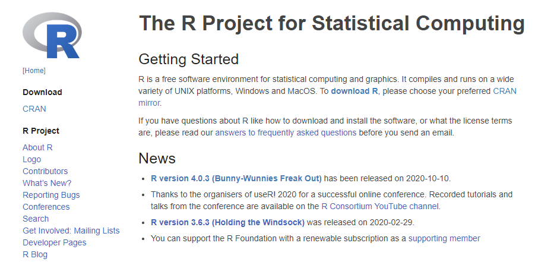
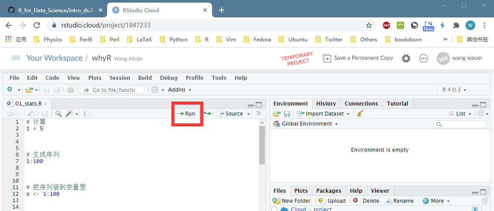
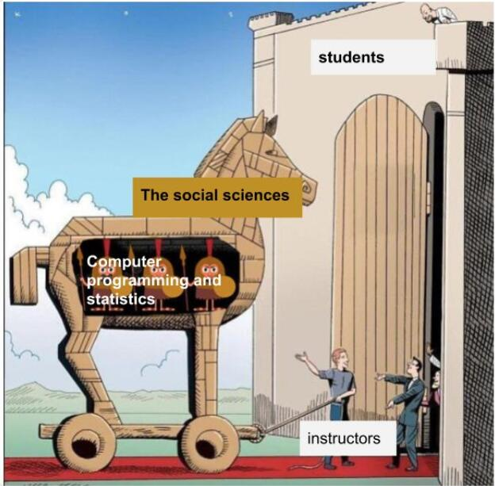
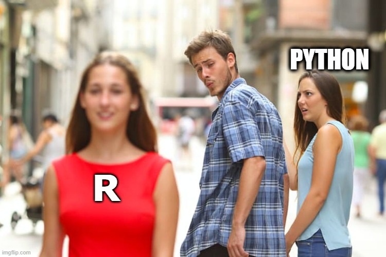

```{r setup, include=FALSE}
options(digits = 3)
knitr::opts_chunk$set(
  comment = "#>",
  echo = TRUE,
  collapse = TRUE,
  message = FALSE,
  warning = FALSE,
  out.width = "50%",
  fig.align = "center",
  fig.asp = 0.618, # 1 / phi
  fig.show = "hold"
)
```

<!-- 数据科学介于  理论和应用之间，起到一个桥梁作用。 -->

<!-- 掌握这个技能，可以 -->

<!-- - 用在工业生产上：公司企业需要，（学科背景+ 统计编程）= 找工作、提升竞争力  找工作 -->
<!-- - 用在创新创业上：培养编程思维，参加各种竞赛，数学建模，算法设计、参与工程项目   赚钱不要想着兼职就是发传单和做家教，也可以是做项目、创新创业。这样既有安全、又有收益 -->
<!-- - 用在科学研究上：读研读博，自然科学、社会科学都需要   发文章 -->
<!-- - 用在学习方法上：改变传统的统计学习方法,  贝叶斯新统计    -->


## 开场白

谢谢主持人，能听清我说话吗？

各位老师，各位同学，大家晚上好，我叫王敏杰，

- 是四川师范大学的一名老师，
- 是R语言tidyverse的死忠粉。

今天很高兴、也很荣幸（借百智享和财经联盟平台）为大家一起交流、分享R语言。


## 开场白


## 开场白

- 非常感谢百智享公司唐总的热情邀请，以及林晗川工程师的细致安排

## 开场白

\LARGE
- 非常感谢百智享公司唐总的热情邀请，以及林晗川工程师的细致安排


## 本节课的目的

\footnotesize
前面几周，大家已经向很多教授和专家学习了python语言。python语言是一个强大的语言，是数据科学的重要工具，
在学术研究和工业领域，都有非常广泛的应用。

经过一段时间的学习，我相信大家应该收获很多，逐步上手了。但也有同学，可能觉得比较难，如果，你觉得python语法很难学，IDE不好用，画图不太好看的时候，
可以考虑学习我们的R语言，
哈哈，有点不怀好意，像来砸python场子的感觉。

事实上，任何一门语言的定位都是不一样的，都有它优势和缺点，我们可以根据自己的需求，选择自己的喜欢的语言。
（人有高矮胖瘦，可以根据自己的身材，选择合适的衣服，没有绝对正确的工具，掌握的最好的，就在好工具）。
\textcolor{red}{我想这就是财经联盟平台包容、强大的地方吧，能够为用户提供更多的选择,  尤其在多元的时代。}


## 本节课的目的


## 本节课的目的

本节课的目的，我这里假定，大家都是小白用户，但是今天，我不打算讲具体的语法，毕竟只有一个小时的时间。

我是想，\textcolor{red}{利用这一个小时的时间，给大家留下两个印象}：

- 第一，R 能给我们生活带来什么？（介绍什么是R？ R能做什么？我们为什么选择R）（明确目标）
- 第二，以最快的速度让大家获得一次成功的经验（有个切身的感受，这个对新用户来说，非常关键）


大家在听我胡说八道的过程中，可以先注册一个 https://rstudio.cloud 账号，然后登录 https://rstudio.cloud/project/1847233


## 本节课的目的


- R能给我们生活带来什么？
  - R是什么?
  - R能干什么?
  - 为什么是R？
  
\vskip 0.5cm

- 五分钟上手R语言
  - 需要一台电脑
  - 注册一个 https://rstudio.cloud 账号
  - 登录 https://rstudio.cloud/project/1847233


## R是什么
好，我们开始，

- 首先说说，R的那些事
\vfill

# R是什么

## R那些事

\vfill
也就说，R为统计而生的一门编程语言，

- 所以这个属性，决定了它是\textcolor{red}{统计编程}语言，不是通用性语言


## R那些事

- 1992年，新西兰奥克兰大学统计学教授 Ross Ihaka 和 Robert Gentleman，为了方便地给学生教授统计学课程，他们设计开发了R语言（他们名字的首字母都是R）。

```{r echo=FALSE, out.width = '0.8\\textwidth'}
knitr::include_graphics(path = "images/R_inventor.png")
```


## R是什么
## R是什么

R语言是用于统计分析，图形表示和报告的编程语言:

- R 是一个\textcolor{red}{统计编程}语言（statistical programming）
- R 可运行于多种平台之上，包括Windows、UNIX 和 Mac OS X
- R 拥有顶尖水准的\textcolor{red}{制图}功能
- R 是免费的
- R 应用广泛，拥有丰富的\textcolor{red}{库包}
- 活跃的\textcolor{red}{社区}(\#rstats)


## R 的前世今生

- 2000年，R1.0.0 发布
- 2004年，第一届国际useR!会议（随后每年举办一次）
- 2005年，ggplot2宏包\textcolor{red}{（2018.8 - 2019.8下载量超过 1.3 亿次）}
- 2012年，R2.15.2 发布
- 2013年，R3.0.2 发布, CRAN上的宏包数量5026个
- 2016年，Rstudio公司推出 tidyverse 宏包\textcolor{red}{数据科学当前最流行的R宏包}
- 2017年，R3.4.1 发布，CRAN上的宏包数量10875个
- 2019年，R3.6.1 发布，CRAN上的宏包数量15102个
- 2020年，R4.0.0 发布，CRAN上的宏包数量16054个


## R 的前世今生

- 2000年，R1.0.0 发布
- 2004年，第一届国际useR!会议（随后每年举办一次）
- 2005年，ggplot2宏包\textcolor{red}{（2018.8 - 2019.8下载量超过 1.3 亿次）}
- 2012年，R2.15.2 发布
- 2013年，R3.0.2 发布, CRAN上的宏包数量5026个
- 2016年，Rstudio公司推出 tidyverse 宏包\textcolor{red}{（数据科学当前最流行的R宏包）}
- 2017年，R3.4.1 发布，CRAN上的宏包数量10875个
- 2019年，R3.6.1 发布，CRAN上的宏包数量15102个
- 2020年，R4.0.0 发布，CRAN上的宏包数量16054个

[The History of R](https://blog.revolutionanalytics.com/2020/07/the-history-of-r-updated-for-2020.html)


## R语言发展趋势

\vfill
从2019年20名上升到2020年8名，

- 可能与新冠肺炎大流行有关，可能大家突然发现，R很原来这么好用

## R语言发展趋势

```{r echo=FALSE, out.width = '100%'}
knitr::include_graphics("images/tiobe-index.png")
```

[TIOBE index](https://www.tiobe.com/tiobe-index/)


## 安装很方便
R语言官方网站一直很朴素。所以，很容易找到下载链接，找到系统对应的版本，就可以了
\vfill

-

## 安装很方便

官网地址：<https://www.r-project.org/>

```{r echo=FALSE, out.width = '100%'}

```

## IDE很舒服

\textcolor{red}{我喜欢R，还有一个很重要的原因}，就是R的IDE，

- Rstudio,  用起来很贴心
- 同时，Rstudio 是一款 可视化编辑器。基于Pandoc的 markdown 标准的，良心可视化编辑器只有两款（Typora 和 Rstudio ），其中一款就是Rstudio


\textcolor{red}{现场演示}：

- 它有四个窗口：
- 如果用最新的版本 1.4版本，你会发现很多又好玩、又适用的功能，比如，这里有个 A图标的，切换到可视化模式，\textcolor{red}{直接修改表格}，有点像word 所见即所得


## IDE很舒服

官网地址：<https://rstudio.com/>

```{r out.width = '80%', echo = FALSE}
knitr::include_graphics("images/rstudio-editor.png")
```

## 两者的关系

R和Rstudio 是什么关系呢？

R 好比汽车的发动机，在里面完成计算，最后通过Rstudio把（运行的结果，生成的图片）呈现出来，所以Rstudio就好比汽车的仪表盘

有时候，我这样比喻，\textcolor{red}{Rstudio是好看的皮囊，R是有趣的灵魂}


## 两者的关系

```{r out.width = '100%', echo = FALSE}
knitr::include_graphics("images/engine_dashboard.png")
```


## 也可以偷懒

安装R + Rstudio 很简单，就像电脑安装QQ一样。

尽管如此，我们还是可以偷懒的，那就是云平台，就是开始，让大家注册的哪个网站

\textcolor{red}{云平台有个好处}：省去了安装R + Rstudio的时间，直接写代码就可以了

## 也可以偷懒

```{r echo=FALSE, out.width = '100%'}
knitr::include_graphics("images/rstudio_cloud.png")
```

注册就可使用：<https://rstudio.cloud/>


## 平台很友好

云平台的界面和本地的Rstudio的界面是一样的，只不过是在浏览器里，所以最上面多了一行网址

\vskip 1cm

好!

我们接着讲其它的内容，留给一点时间

- 还没有注册的同学，接着注册
- 注册并登录成功的同学，可以打个 +1 

## 平台很友好

```{r out.width = '99%', echo = FALSE}
knitr::include_graphics("images/rstudio-cloud.png")
```


## R路上的大神

- 现在，R语言做（数据探索 + 可视化 + 数据分析），大都喜欢用 tidyverse 包（流行）。 

- 个人觉得，数据科学领域里，\textcolor{red}{R之所以能和python平分天下，主要得益于tidyverse的存在}

- tidyverse 是美国 Rstudio 公司（就是我们之前提到的IDE）首席科学家 Hadley Wickham 和他的团队开发的

- tidyverse深受用户喜欢，Hadley Wickham 也因此被称为 R 路上的大神， 一个改变了 R 语言的人

-  2019 年 8 月，国际统计学年会将考普斯总统奖（被誉为统计学的诺贝尔奖）奖颁给Hadley Wickham 

- 说明 R 语言得到了学术界的充分认可。


## R路上的大神

2019 年 8 月，国际统计学年会将考普斯总统奖（\textcolor{red}{被誉为统计学的诺贝尔奖}）奖颁给 tidyverse 的作者

```{r echo=FALSE, out.width = '50%'}
knitr::include_graphics("images/hadley-wickham.jpg")
```

- [Hadley Wickham](http://hadley.nz/)
- R路上的大神
- 一个改变了R语言的人


## R能干什么
那么R 或者tidyverse 能干什么事情呢？ 
\vfill
听我慢慢道来

# R能干什么


## 数据科学的流程
刚才讲到了大神Hadley Wickham， 他将数据科学分成了6个环节

\vfill
- \textcolor{red}{每一个环节}，都在代码里完成。
- 代码里完成，有什么好处？最大的好处：可重复性，等会演示给大家看

## 数据科学的流程

Hadley Wickham将[数据科学流程](https://r4ds.had.co.nz/)分解成6个环节


```{r echo=FALSE, out.width = '\\textwidth'}
knitr::include_graphics(path = "images/data-science-explore.png")
```


## tidyverse套餐

\textcolor{red}{光定义一个流程是不够的}，

Hadley Wickham更重要的贡献，就是，\textcolor{red}{为每个环节都开发设计了相应的宏包}（工具箱）。
这样用起来，就很超级方便了。比如读取数据用readr。。。

\vfill
这些宏包的集合（这些宏包打个包），就是 tidyverse，即 tidyverse 套餐

因为tidyverse套餐是同一个团队开发的，因此tidyverse 相比其它宏包而言，具有明显的\textcolor{red}{优势}

- 语法一致性（学习一个宏包，可以帮助理解其他宏包）
- 代码可读性，接近人类语言 ( %>% 太酷了 )，写代码和说话一样自然


## tidyverse套餐

```{r out.width = '80%', echo = FALSE}
knitr::include_graphics("images/tidyverse.png")
```
\centering{https://www.tidyverse.org/}


## 以最快的速度获得一次成功的经验

\textcolor{red}{打了很长时间的广告，到底好不好，还要看疗效}。

下面我们就通过代码，演示下R能干什么。


\vfill
我们现在一起，大家登录云平台，然后打开链接

就出现这个界面...

\textcolor{red}{这里要演示4份代码}

## 以最快的速度获得一次成功的经验

- 登录 https://rstudio.cloud
- 打开链接 https://rstudio.cloud/project/1847233
- 运行代码（点击右上角的 `Run`）

```{r out.width = '100%', echo = FALSE}

```


## 生成pdf
出pdf的时候，应该有掌声，尽管我听不到

## 生成pdf

```{r out.width = '65%', echo = FALSE}
knitr::include_graphics("images/rstudio-cloud-pdf.png")
```

- Console中输入`tinytex::install_tinytex()`回车
- 等待2分钟，然后重新点击`Knit`就可以看到pdf了


<!-- ## R能干什么 -->
<!-- 通过案例演示，我们可以得出，R可以完成如下一些事情 -->
<!-- \vfill -->


<!-- ## R能干什么  -->

<!-- | 序号 	| 内容         	| 代码演示                                        	| -->
<!-- |------	|--------------	|-------------------------------------------------	| -->
<!-- | 1    	| 统计         	| [1_stats.R](./exercises/01_stats.R)              	| -->
<!-- | 2    	| 可视化       	| [2_visual.R](./exercises/02_visual.R)       	      | -->
<!-- | 3    	| 探索性分析   	| [3_eda.R](./exercises/03_eda.R)         	          | -->
<!-- | 4    	| 可重复性报告 	| [4_reproducible.R](./exercises/04_reproducible.R) 	| -->


## 难吗？
## 难吗？
\Huge
\centering{ 感觉很难吗？ \\ 如果是，那说明你认真听了}


## 看了这些代码，可能第一眼感觉是这样的

这是一部科幻电影，讲的是外星人突然降临到地球，并且向人类发出了讯号，这个奇怪的圈圈。

- 我想第一次看R代码，和看到外星人的文字，感觉是一样的吧
\vfill

## 看了这些代码，可能第一眼感觉是这样的
```{r echo=FALSE, out.width = '100%', fig.cap='图片来自电影《降临》'}
knitr::include_graphics("images/arrival-movie.png")
```


## 但我更希望学完后
## 但我更希望学完后
```{r echo=FALSE, out.width = '100%', fig.cap='图片来自美剧《权利的游戏》'}

```


## 为什么是R

好，我们接着讲。

- 既然很难，但我们为什么还要选择R？
- 因为，\textcolor{red}{不做难一点的事情，我们怎么超越别人呢？}
- 事实上，我列出了几点理由

# 为什么是R


## 社会科学需要统计
一个学科之所以成为一门科学，必须要有数学作为基础。我说这话，相信很多人会反驳我。我接受反驳。但我还是会坚持我的观点。

很多同学在选专业的时候，导师会说，这个专业不会用太多数学，事实上被忽悠了，尤其在（新文科建设、跨学科研究）背景下，社会科学（包括心理学、语言学）都在交叉融合，都需要用数学和计算机。

所以，我们不是学统计的，但需要用统计。
\textcolor{red}{一个更残酷的现实，往往用的统计的，都不是学统计的}。


## 社会科学需要统计

```{r echo=FALSE, out.width = '60%'}

```

\centering{往往用的统计的，都不是学统计的}


## 社会科学需要可视化

可视化，这个理由很显然了。我们人，都是视觉动物，都喜欢看漂亮美好的东西。如果文章或者报告太多表格，不会给人留下深刻影响；相反，用图片，重点突出，一图胜千言，很容易传递信息。当然，前提是，画图要画的好。

\textcolor{red}{又一个残酷的现实}

- 在这个看脸的时代，没有好看的皮囊，没人愿意了解你的灵魂。


## 社会科学需要可视化

```{r echo=FALSE, out.width = '100%'}
knitr::include_graphics("images/HotlineDrake1.jpg")
```


\centering{没有好看的皮囊，没人愿意了解你的灵魂}


## 社会科学需要编程

\footnotesize
为什么要编程，回答这个问题，相当于回答，为什么不能用excel做数据分析？

我们这里用这个图，说明这个问题

- 横坐标=数据量的大小或者问题复杂程度，
- 纵坐标=解决问题的困难程度。


大家看这条excel红线，

- 对于数据量不大，或者复杂程度不高的需求来说，比如10行10列，excel很方便也很直观，很容易搞定。
- 但，随着数据量或复杂程度不断增大，用excel解决起来，难度系数就会陡增，或者无法搞定，这就需要借助编程完成。

从另外一个角度看，掌握了编程技能，比如这里的R，对于简单的问题和复杂的问题，难度系数是差不多了。


所以，\textcolor{red}{第三残酷的现实：现在小学生都开始学编程了}


## 社会科学需要编程

```{r out.width = '100%', fig.align='center', echo = FALSE}
knitr::include_graphics("images/R_Excel.png", dpi = 150)
```

\centering{现在小学生都开始学编程了}


## 社会科学需要可重复性
科学的可重复性危机，已经成为举世瞩目的热点议题。

- 科研结果\textcolor{red}{可重复性低}的原因很多很多。
- \textcolor{red}{不可重复，说明事情没那么简单}。

或许，科学固有不确定性，但需要从研究方法、实验设计和统计方法方面改进

\textcolor{red}{第四个残酷的现实}：科学研究的方向是（开放科学框架(Open Science Framework, OSF)）, 正如Nature期刊要求的一样，需要公布原始数据和如何分析的代码


## 社会科学需要可重复性

```{r echo=FALSE, out.width = '100%'}
knitr::include_graphics("images/nature_editorial.png")
```

\centering{
论文，要公布原始数据和如何分析的代码}


## 4个残酷的现实
刚才说了4个残酷的现实，很沮丧，何以解忧？


##

```{r echo=FALSE, out.width = '100%'}

```

## 何以解忧
何以解忧， 唯有撸R

我想，R语言之美，可以缓解你的压力

##
```{r echo=FALSE, out.width = '100%'}

```

\centering{何以解忧，唯有撸R}


## 何以解忧
怕怕

##
```{r echo=FALSE, out.width = '100%'}

```

\centering{ 何以解忧，\xout{唯有} 可以撸R }


## R语言之美，你值得拥有

\footnotesize
我想，R语言之美，可以缓解你的压力

- 首先，R语言做统计分析，是它的看家本领，非常好用 (可以缓解第一个残酷)
- 其次，ggplot2画图，是颜值担当，非常好看，一直被模仿，从未被超越(可以解决第一个残酷)
- tidyverse来编程，代码可读性强，用的是**人类语言**， 非常好学 	（在解决残酷现实的同时，还让你感受到乐趣）
- 关于第四点，需要特别说明下，Rmarkdown 并不能保证**研究结果可重复性**，因为影响结果可重复性的原因很多很多，这不是程序语言能解决的事。但是，R语言能帮你的，就是减少低级的计算错误和复制粘贴等繁琐工作，可以生成html、word或者pdf 格式的可重复性报告文档，可以方便快捷做幻灯片、海报、论文、书籍、网页。所以还是挺好玩的/

所以，\textcolor{red}{R语言之美，你值得拥有}

## R语言之美，你值得拥有

<!-- \centering -->
<!-- \raisebox{-.5\height}{\includegraphics[height=3\baselineskip]{images/R_logo.png}} -->
<!-- 专业之美 -->


| 序号 	| 内容          	| 特性     	| 评价 	| 
|------	|---------------	|----------	|------	|
| 1    	| 统计分析      	| 看家本领 	| 好用 	|
| 2    	| ggplot2画图   	| 颜值担当 	| 好看 	| 
| 3    	| tidyverse语法 	| 人类语言 	| 好学 	| 
| 4    	| 可重复性报告  	| 方便快捷 	| 好玩 	| 


## 当今最值得学习的数据科学语言

所以，这篇文章，旗帜鲜明的指出，\textcolor{red}{R语言，是当今最值得学习的数据科学语言}。罗列了很多理由，
其中的3点理由，我圈出来了(传统的统计学，贝叶斯新统计、数据可视化)，我看完这篇文章的感受是：

- 第一、在数据科学领域，python能做的，R也能做，甚至更好，比如可视化。
- 第二、有一定R基础后，对统计学的学习帮助很大，这是 python 语言不具备的
- 第三、我觉得 R的语法 更符合人的思维方式。


说到思维方式，忍不住想吐槽python语言了（云平台）

\vfill
不能再说python的坏话，再说，林总可能要把我提出群了


## 当今最值得学习的数据科学语言

```{r echo=FALSE, out.width = '100%'}
knitr::include_graphics("images/why_R_is_best_language.png")
```

\tiny
https://www.r-bloggers.com/2017/01/why-r-is-the-best-data-science-language-to-learn-today/


## 一见钟情，还是相见恨晚？
所以，是一见钟情，还是相见恨晚？

## 一见钟情，还是相见恨晚？

```{r echo=FALSE, out.width = '100%'}

```


## 

剧情，是这样发展的....

## 

```{r echo=FALSE, out.width = '100%'}

```


## 

然后，...

## 

```{r echo=FALSE, out.width = '100%'}
knitr::include_graphics("images/memeR3.png")
```


## 

但结局，总是出乎人的意料... 

## 

```{r echo=FALSE, out.width = '100%'}

```


## 

我想说的是，R和python实际上是好朋友，他们相互吐槽，也相互学习了很多，比如python 向R学习了数据框的概念，R也python借鉴了爬虫的思想

## 

```{r echo=FALSE, out.width = '100%'}
knitr::include_graphics("images/memeR5.png")
```


<!-- # 关于学习 -->

<!-- ## 我们的课程不会枯燥 -->

<!-- ```{r echo=FALSE, out.width = '45%'} -->
<!-- knitr::include_graphics("images/data_science.png") -->
<!-- ``` -->

<!-- - 数据科学是为社会科学服务的，我们会有很多案例 -->
<!-- - 编程是工具，统计是灵魂，专业是核心 -->


<!-- ## 关于学习 -->

<!-- 我很少使用 -->

<!-- $$ -->
<!-- f(x)=\frac{1}{\sqrt{2 \pi}} e^{-\frac{1}{2} x^{2}} -->
<!-- $$ -->

<!-- 更多的是 -->

<!-- ```{r, eval = FALSE} -->
<!-- library(tidyverse) -->
<!-- summary_monthly_temp <- weather %>%  -->
<!--   group_by(month) %>%  -->
<!--   summarize(mean = mean(temp),  -->
<!--             std_dev = sd(temp)) -->
<!-- ``` -->


<!-- ## 参考书目 -->

<!-- ```{r echo=FALSE, out.width = '35%'} -->
<!-- knitr::include_graphics("images/r4ds-cover.png") -->
<!-- ``` -->

<!-- - [R for Data Science](https://r4ds.had.co.nz/) -->
<!-- - [https://bookdown.org/wangminjie/R4DS/](https://bookdown.org/wangminjie/R4DS/) -->


<!-- ## Welcome to R, RStudio, and the tidyverse! -->

<!-- ### 课程目标 -->

<!-- -   训练数据思维，提升编程技能，培养创新能力 -->

<!-- ### 学习方法 -->

<!-- -   **问题驱动型学习** -->
<!-- -   把 R 看做是知识学习的**脚手架** -->

<!-- ```{r echo=FALSE, out.width = '45%'} -->
<!--  -->
<!-- ``` -->


## 
最后，欢迎大家来到R语言的社区。

希望，\textcolor{red}{大家多用R}，把 R 当作知识学习的\textcolor{red}{脚手架}！它就像修房子时候搭的架子一样，你的学科就是这个房子，R就是好用的工具。我一直比较**满意**，自己找到的这个**比喻词**。


最后，再次感谢唐总和林总，感谢同学聆听/

我今天，在这里给大家讲座，很开心，让我获得了很多激励和灵感，我期待下次，还有很多机会再和大家相聚。


谢谢大家。


## 

\Huge
\centering{ 
Welcome to R, RStudio, and the tidyverse!
}


